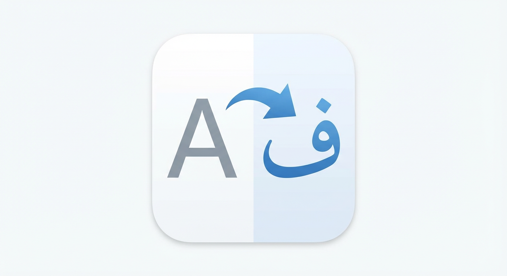

<div align="center">



# FontShifter

**فونت هر وب‌سایتی را تغییر دهید — با تنظیمات جداگانه برای هر سایت یا سراسری، و جهت راست‌به‌چپ اختیاری.**

[](https://microsoftedge.microsoft.com/addons/detail/fontshifter/fkmmebmnphbkflalkijaelpbgiddeagj)
[](https://github.com/DivSlayer/FontShifter/releases/latest)
[](#-مجوز)

[English](README.md) · **فارسی**

</div>

---

<div dir="rtl">

## ✨ امکانات

- 🎨 **فونت‌های زیبای همراه افزونه** — دانا، ایران‌سنس و وزیر، آماده‌ی اعمال تنها با یک کلیک.
- 🌍 **برای هر سایت یا سراسری** — فونت را فقط برای وب‌سایت فعلی تنظیم کنید، یا آن را به‌عنوان پیش‌فرض همه‌ی سایت‌ها قرار دهید.
- ↔️ **کلید مستقل راست‌به‌چپ (RTL)** — جهت راست‌به‌چپ را *جدا* از فونت روشن یا خاموش کنید. می‌توانید فقط شکل حروف را تغییر دهید بدون دست‌زدن به چیدمان، یا فقط جهت را برگردانید بدون تغییر فونت.
- ⚡ **سازگار با سایت‌های مدرن (SPA)** — پشتیبانی قدرتمند از محتوای پویا، وب‌کامپوننت‌ها و Shadow DOM (مانند Claude.ai، ChatGPT و سایت‌های مشابه).
- 🔒 **سازگار با CSP** — از Constructable Stylesheets و فونت‌های میزبانی‌شده در خود افزونه استفاده می‌کند، بنابراین بدون حذف هیچ هدر امنیتی‌ای کار می‌کند.

---

## 📦 نصب از فروشگاه Microsoft Edge Add-ons

ساده‌ترین راه نصب — تنها با یک کلیک، همراه با به‌روزرسانی خودکار:

</div>

<div align="center">

### [⬅️ دریافت FontShifter از فروشگاه Microsoft Edge Add-ons](https://microsoftedge.microsoft.com/addons/detail/fontshifter/fkmmebmnphbkflalkijaelpbgiddeagj)

</div>

<div dir="rtl">
---

## 🧩 استفاده در Edge از طریق «Load Unpacked»

ترجیح می‌دهید افزونه را مستقیماً از روی کد اجرا کنید، یا می‌خواهید جدیدترین نسخه را پیش از رسیدن به فروشگاه داشته باشید؟ می‌توانید افزونه را در چند مرحله به‌صورت دستی بارگذاری کنید.

### ۱. دانلود فایل ZIP

آخرین نسخه‌ی بسته‌بندی‌شده را از اینجا دریافت کنید:

</div>

<div align="center">

### [⬇️ دانلود آخرین نسخه (ZIP)](https://github.com/DivSlayer/FontShifter/releases/latest)

</div>

<div dir="rtl">

سپس فایل ZIP را در یک پوشه‌ی **دائمی** از حالت فشرده خارج کنید (اگر بعداً پوشه را حذف کنید، افزونه از کار می‌افتد).

### ۲. باز کردن صفحه‌ی افزونه‌ها

در مرورگر Microsoft Edge به این آدرس بروید:

</div>

```
edge://extensions
```

<div dir="rtl">

(می‌توانید این آدرس را در نوار آدرس کپی کنید.)

### ۳. فعال‌کردن حالت توسعه‌دهنده (Developer mode)

کلید **Developer mode** را در گوشه‌ی پایین-سمت چپِ صفحه‌ی افزونه‌ها روشن کنید.

### ۴. بارگذاری افزونه

۱. روی **Load unpacked** کلیک کنید.
۲. پوشه‌ای را که در مرحله‌ی ۱ استخراج کردید انتخاب کنید (پوشه‌ای که شامل فایل **`manifest.json`** است).
۳. حالا FontShifter در فهرست افزونه‌ها و نوار ابزار شما ظاهر می‌شود. 🎉

> **نکته:** با کلیک روی آیکن پازل، افزونه را به نوار ابزار سنجاق (Pin) کنید تا همیشه با یک کلیک در دسترس باشد.

---

## 🚀 نحوه‌ی استفاده

۱. روی آیکن **FontShifter** در نوار ابزار کلیک کنید.
۲. پنجره‌ی افزونه، **سایت فعلی** را در بالا نشان می‌دهد.
۳. یک فونت انتخاب کنید — **دانا**، **ایران‌سنس** یا **وزیر** — یا برای عدم تغییر فونت، گزینه‌ی **Restore Default** را بزنید.
۴. کلید **راست‌به‌چپ (RTL)** را روشن یا خاموش کنید. این کلید مستقل از فونت است:
   - فونت **+** RTL ← اعمال یک فونت فارسی و برگرداندن جهت.
   - **فقط** فونت ← تغییر شکل حروف، بدون دست‌زدن به جهت سایت.
   - **فقط** RTL (انتخاب Restore Default به‌همراه روشن‌بودن RTL) ← برگرداندن جهت بدون تغییر فونت.
۵. انتخاب خود را ذخیره کنید:
   - **Save for This Site** ← فقط برای وب‌سایت فعلی اعمال می‌شود.
   - **Set as Global** ← به پیش‌فرض همه‌ی سایت‌ها تبدیل می‌شود (تنظیم مخصوص هر سایت همیشه بر تنظیم سراسری اولویت دارد).

---

## 🗂️ ساختار پروژه

</div>

| فایل | کاربرد |
| --- | --- |
| `manifest.json` | مانیفست افزونه (Manifest V3). |
| `popup.html` / `popup.css` / `popup.js` | رابط کاربری پنجره‌ی نوار ابزار و منطق آن. |
| `content_script.js` | اعمال فونت و جهت روی هر صفحه و هر shadow root. |
| `injector.js` | اسکریپت MAIN-world که برای پشتیبانی از Shadow DOM، تابع `attachShadow` را هوک می‌کند. |
| `fonts/` | فایل‌های فونت `.woff2` همراه افزونه. |

<div dir="rtl">

---

## 📄 مجوز

منتشر شده تحت مجوز **MIT**.

</div>

---

<div align="center">

ساخته‌شده با ❤️ برای تایپوگرافی بهتر در وب.

</div>
